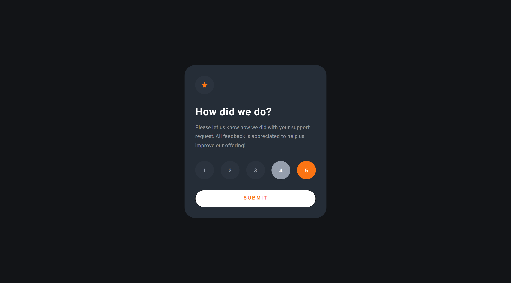

# Frontend Mentor - Interactive rating component solution

This is a solution to the [Interactive rating component challenge on Frontend Mentor](https://www.frontendmentor.io/challenges/interactive-rating-component-koxpeBUmI). Frontend Mentor challenges help you improve your coding skills by building realistic projects. 

## Table of contents

- [Overview](#overview)
  - [The challenge](#the-challenge)
  - [Screenshot](#screenshot)
  - [Links](#links)
- [My process](#my-process)
  - [Built with](#built-with)
  - [What I learned](#what-i-learned)
  - [Continued development](#continued-development)
- [Author](#author)

## Overview

This is the second challenge in the **JavaScript Fundamentals Frontend Mentor Roadmap**.

The challenge requires manipulating the DOM to show a "Thank you Note" after the user submits a rating.

### The challenge

Users should be able to:

- View the optimal layout for the app depending on their device's screen size
- See hover states for all interactive elements on the page
- Select and submit a number rating
- See the "Thank you" card state after submitting a rating

### Screenshot

#### Mobile

##### Initial View

##### Interactive States View

##### Thank you View

#### Desktop

##### Initial View

##### Interactive States View

##### Thank you View

### Links

- Solution URL: [Solution URL](https://www.frontendmentor.io/solutions/interactive-rating-component-6HtHkmp7hE)
- Live Site URL: [Live Site URL](https://frontendmentor-ilyesab.github.io/interactive-rating-component/)

## My process

### Built with

- Semantic HTML5 markup
- CSS custom properties
- CSS Grid
- Mobile-first workflow
- Vanilla JS

### What I learned

I used a `<template>` element to hold the markup for the **Thank you View**. the contents of the template are not shown in the document but as the name of the element suggest the contents act as a template to be inserted somewhere using Javascript.

When the user selects a rating and submits. we remove the children of the body and insert the contents of the template.

I also learned about event delegation so rather than listening for a click event on each of the rating circles. we listen for the event on the parent container and filter out undesired clicks in the process.

### Continued development

I'd like to get more practice using **Vanilla JS** for DOM manipulation before jumping to frameworks.

## Author

- Frontend Mentor - [@ilyesab](https://www.frontendmentor.io/profile/ilyesab)
